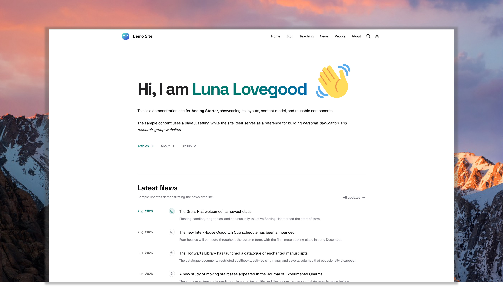
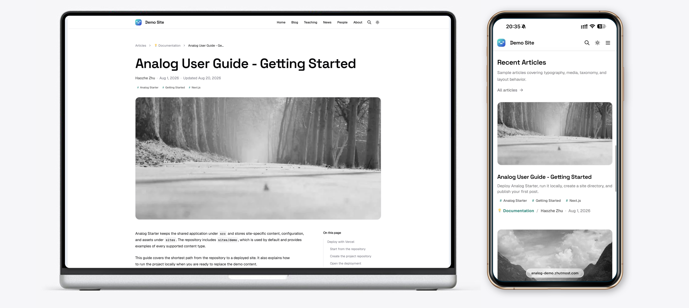
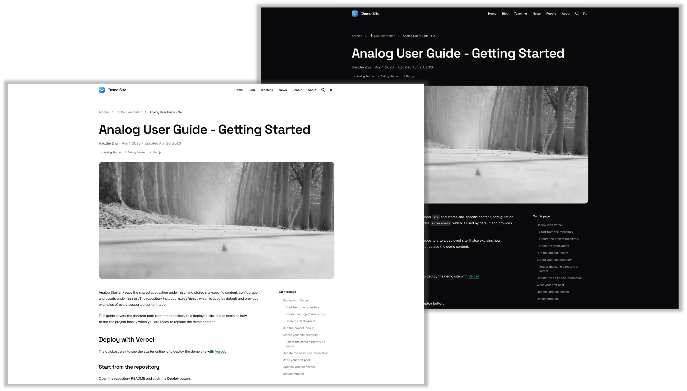

<div align="center">
  <h1>Analog: Another (Academic) Blog Starter</h1>
  <p><strong>A content-driven Next.js starter for blogs, academic websites, and research groups.</strong></p>
  <p>
    <a href="https://analog-demo.zhutmost.com">🔍 Live Demo</a> |
    <a href="https://analog-demo.zhutmost.com/post/docs/getting-started">📖 Documentation</a> |
    <a href="https://github.com/zhutmost/analog-blog-starter/issues">🐞 Issues</a>
  </p>
</div>

<div align="center">

[](https://github.com/zhutmost/analog-blog-starter/actions/workflows/code-quality.yml)
[](LICENSE)

</div>



**Analog** is a flexible starter for publishing articles, documentation, project updates, and research-group content. It is perfect for individual blogs, especially **academic or technology blogs**.

**Live Preview**:

- [Analog Demo](https://analog-demo.zhutmost.com) - Demo blog (i.e., Docs site) of the Analog Blog Starter.
- [zhutmost.com](https://blog.zhutmost.com) - My personal blog.

Check out the documentation below to get started.

## 🚀 Quick start

### Deploy with Vercel

Deploy the default demo site to a new repository and Vercel project:

[](https://vercel.com/new/clone?repository-url=https%3A%2F%2Fgithub.com%2Fzhutmost%2Fanalog-blog-starter&project-name=analog-starter&repository-name=analog-starter&demo-title=Analog%20Starter&demo-description=A%20content-driven%20Next.js%20starter&demo-url=https%3A%2F%2Fanalog-demo.zhutmost.com)

The default build uses `sites/demo`. To deploy a different site directory, set the `SITE_DIR` environment variable in Vercel.

See the [Getting Started guide](https://analog-demo.zhutmost.com/post/docs/getting-started) for the complete deployment and customization process.

### Run locally

Install [Bun](https://bun.sh), clone the repository, and start the development server:

```bash
git clone https://github.com/zhutmost/analog-blog-starter.git
cd analog-blog-starter

bun install
bun run dev
```

Open [http://localhost:3000](http://localhost:3000).

To create a separate site while keeping the demo as a reference:

```bash
cp -R sites/demo sites/my-site
```

Restart the development server after changing `SITE_DIR`:

```bash
export SITE_DIR=sites/my-site && bun run dev
```

## 🎁 Features

Analog includes plentiful search, comment, sharing and other plugins out of the box that makes your blog feature-rich and powerful.

- [**Fully Responsive Design**](#responsive-design)
- [**Dark & Light Mode Switching**](#dark--light-mode)
- **Diverse Pages**

  [Blog](https://analog-demo.zhutmost.com/posts) · [Tags](https://analog-demo.zhutmost.com/posts/tags) · [People](https://analog-demo.zhutmost.com/people) · [Author](https://analog-demo.zhutmost.com/about) · [News](https://analog-demo.zhutmost.com/news)

- **Style-rich Writing** [Demo](https://analog-demo.zhutmost.com/post/test/markdown-basic)

  MDX (Markdown + JSX) · Katex (math support) · Shiki (code highlighting)

- **Integrations**

  Giscus Comment System · Umami Web Analytics · Cmd+K Built-in Search

- **Other**

  RSS · Sitemap · Social Share (OpenGraph + Twitter Card)

### Responsive Design

Give your audiences best viewing experience with the mobile-friendly responsive layout.



### Dark & Light Mode

Make your blog more comfortable to read with the dark/light mode switching.



## Project structure

```text
.
├── src/                    Shared application code
│   ├── app/                Next.js routes and layouts
│   ├── components/         Shared interface components
│   ├── content-collections/
│   └── lib/
├── sites/
│   └── demo/               Demo content and documentation
├── scripts/                Build and asset synchronization scripts
├── content-collections.ts
└── next.config.ts
```

Each site may contain:

```text
sites/example/
├── _authors/               Internal author profiles
├── _pages/                 Custom pages, including an optional news page
├── _posts/                 Articles and local article assets
├── public/                 Site-level public assets
├── src/                    Optional site-specific data modules
├── home-intro.mdx          Optional homepage introduction
├── people.yml              Optional people collection
├── site.config.ts          Site-wide configuration
└── next.config.ts          Optional site-specific Next.js settings
```

The active site is selected through `SITE_DIR`. When it is omitted, Analog uses `sites/demo`.

## ⌨️ Commands

| Command                | Description                               |
| ---------------------- | ----------------------------------------- |
| `bun run dev`          | Start the development server              |
| `bun run build`        | Create a production build                 |
| `bun run start`        | Start the production server               |
| `bun run lint`         | Run Oxlint checks                         |
| `bun run lint:write`   | Fix auto-fixable lint issues              |
| `bun run format`       | Check formatting with Oxfmt               |
| `bun run format:write` | Format supported files                    |
| `bun run check`        | Run lint and formatting checks            |
| `bun run check:write`  | Apply available lint and formatting fixes |

A different site can be selected for development or builds:

```bash
export SITE_DIR=sites/my-site && bun run build
```

## 🎉 Issues & Feature Requests

If you find any bugs in my code or have any ideas to improve this, please feel free to open an [issue](https://github.com/zhutmost/analog-blog-starter/issues). I will be glad to join the discussion.

## 💡 Inspiration

This project is on the shoulder of giants. See [Tech Stack](https://analog-demo.zhutmost.com/post/docs/tech-stack) for more details.
